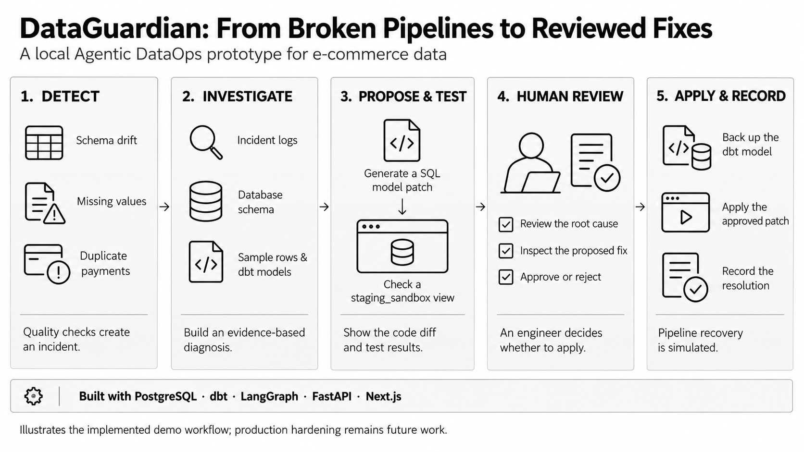
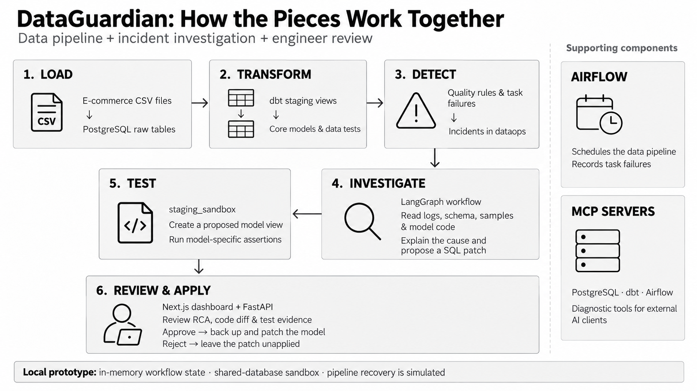

# DataGuardian

**Detect data issues, explain their cause, and review a proposed SQL fix in one workflow.**

DataGuardian is an Agentic DataOps prototype built around an e-commerce warehouse. It connects data quality checks, evidence-based investigation, dbt model patches, sandbox assertions, and an operations dashboard so an engineer can understand an incident before approving a change.



[Quickstart](#quickstart) · [Try an incident](#try-an-incident) · [Architecture](#architecture) · [MCP tools](#mcp-tools) · [Current scope](#current-scope)

## What does it do?

A renamed source column can break a transformation. Missing order statuses can undermine reporting. Duplicate payments can inflate totals. DataGuardian turns these failures into an investigation with evidence, an explanation, and a reviewable model change.

| Problem | What DataGuardian inspects | Proposed model change |
| --- | --- | --- |
| Schema drift in customers | Actual columns, expected fields, and the staging model | Adapt the SQL to the changed source column |
| Missing order statuses | Null checks and affected sample rows | Add a fallback for missing statuses |
| Duplicate payments | Repeated payment keys and sample records | Deduplicate the staging output |

These changes repair the transformed output; they do not reconstruct missing source information. Engineers should review the business meaning of every proposed fix.

## How it works

1. **Detect.** Run warehouse quality rules or capture an Airflow task failure. Incidents are stored in `dataops.incidents`.
2. **Investigate.** A LangGraph workflow reads incident details, database metadata, sample rows, dbt model code, and contracts.
3. **Explain and propose.** Generate a structured root cause analysis (RCA), a proposed SQL model patch, and a code diff. RCA can use an optional LLM or deterministic evidence synthesis.
4. **Test.** Create a view in `staging_sandbox` and evaluate model-specific assertions, such as null checks, payment key uniqueness, or expected columns.
5. **Review.** The dashboard presents the explanation, patch, and sandbox results. The workflow waits for an engineer to approve or reject.
6. **Apply and record.** Approval invokes model backup and patch application, followed by the recovery stub and incident resolution logging. Rejection leaves the proposed patch unapplied.

Sandbox checks provide evidence for review; they are not a guarantee of correctness. See [current scope](#current-scope) for the implementation boundaries.

## Architecture



| Component | Technology | Responsibility |
| --- | --- | --- |
| Warehouse | PostgreSQL 15 | Source data, transformed models, sandbox views, incidents, and audit records |
| Transformations | dbt-postgres | Staging views, core models, and data tests |
| Orchestration | Apache Airflow 2.9.2 | E-commerce DAG and task failure callbacks |
| Investigation | LangGraph + LangChain | Stateful investigation, RCA, patch generation, and human review |
| API | FastAPI | Incident queries, diagnosis, approval, and simulation endpoints |
| Dashboard | Next.js 16 + React 19 + Tailwind CSS | Pipeline overview, incident details, code diffs, and review actions |
| External tools | Model Context Protocol (MCP) | PostgreSQL, dbt, and Airflow diagnostic interfaces |

The data pipeline is `CSV seed files → raw tables → staging models → core models → dbt tests`. Operational records live in `dataops`; proposed model views are evaluated in `staging_sandbox`.

## Quickstart

Run commands from the repository root unless stated otherwise. The core demo uses local Python and Node.js processes with PostgreSQL in Docker; Airflow is optional.

**Prerequisites:** Docker Compose, Python 3.11+, and Node.js 20.9+ with npm.

### 1. Install Python dependencies

```bash
python -m venv .venv
```

Activate the environment:

```powershell
# Windows PowerShell
.venv\Scripts\Activate.ps1
```

```bash
# macOS / Linux
source .venv/bin/activate
```

```bash
python -m pip install -r requirements.txt
```

Create a `.env` file in the repository root with the following local demo settings. If one already exists, review it instead of replacing it.

```dotenv
POSTGRES_USER=data_guardian
POSTGRES_PASSWORD=guardian_pass
POSTGRES_HOST=localhost
POSTGRES_PORT=5432
POSTGRES_DB=data_guardian_db
```

Keep the database name and credentials aligned with [dbt/profiles.yml](dbt/profiles.yml), which currently hardcodes them. Compose and Python default to port `5432`, while the dbt profile defaults to `5433`; explicitly export `POSTGRES_PORT` for dbt in the terminal used below:

```powershell
# Windows PowerShell
$env:POSTGRES_PORT = "5432"
```

```bash
# macOS / Linux
export POSTGRES_PORT=5432
```

If port `5432` is occupied, use the same alternative port in both `.env` and your shell.

### 2. Start the warehouse and load the sample data

```bash
docker compose up -d postgres
docker compose ps postgres
```

Wait until PostgreSQL is healthy, then run:

```bash
python scripts/ingest_raw.py
dbt debug --project-dir dbt --profiles-dir dbt
dbt run --project-dir dbt --profiles-dir dbt
dbt test --project-dir dbt --profiles-dir dbt
python scripts/run_quality_checks.py
```

On a fresh PostgreSQL volume, Docker runs [scripts/init_db.sql](scripts/init_db.sql) to create the schemas and operational tables. Existing volumes do not rerun that initialization automatically.

### 3. Start the API and dashboard

In the activated Python environment:

```bash
uvicorn backend.main:app --reload --port 8000
```

In a second terminal:

```bash
cd dashboard
npm install
npm run dev
```

Open the [dashboard](http://localhost:3000) and [interactive API docs](http://localhost:8000/docs). The dashboard defaults to `http://localhost:8000/api`; override `NEXT_PUBLIC_API_URL` in `dashboard/.env.local` if needed.

### Optional: LLM-assisted explanations

The demo supports deterministic RCA without an API key. To enable LLM-assisted RCA, configure these variables in the root `.env`:

```dotenv
LLM_API_KEY=your_provider_key
LLM_MODEL=your_model_name
# Optional OpenAI-compatible endpoint:
# LLM_BASE_URL=https://your-provider.example/v1
```

`OPENAI_API_KEY` is also accepted. If LLM generation fails, the RCA service falls back to evidence synthesis. Keep credentials out of Git.

## Try an incident

Use a disposable local demo database: these commands deliberately alter source tables, and reset reloads the seed data.

```bash
# Choose one scenario
python scripts/simulate_incident.py --incident null_spike
# python scripts/simulate_incident.py --incident schema_drift
# python scripts/simulate_incident.py --incident duplicates

# Detect the injected issue and emit an incident
python scripts/run_quality_checks.py
```

A nonzero exit from quality checks is expected when an injected issue is detected. In the dashboard, select the incident, trigger diagnosis, review the RCA, code diff, and sandbox results, then approve or reject the proposed patch. The API's `/api/simulate` route also supports simulation and runs quality checks after injection.

After approval, rerun the transformations and tests to verify the actual warehouse outcome:

```bash
dbt run --project-dir dbt --profiles-dir dbt
dbt test --project-dir dbt --profiles-dir dbt
```

Restore source tables when finished:

```bash
python scripts/simulate_incident.py --reset
```

Reset restores source data; it does not undo approved SQL file changes. Inspect model changes with Git, or use the backup copies under `dbt/.backups/` to restore a model before rebuilding.

## MCP tools

Three diagnostic servers let an MCP-compatible client inspect the project:

| Server | Entry point | Tools cover |
| --- | --- | --- |
| PostgreSQL | `mcp/servers/postgres_server.py` | Schema inspection, sample rows, and read queries |
| dbt | `mcp/servers/dbt_server.py` | Model source, contracts, and dependencies |
| Airflow | `mcp/servers/airflow_server.py` | Pipeline structure and incident details |

Use [mcp/mcp_config.json](mcp/mcp_config.json) as a starting point. Set the Python executable and server script arguments to absolute paths for your machine, and align the database environment variables with your local warehouse. MCP clients launch these stdio servers; they are not HTTP services.

## Optional Airflow orchestration

[ecommerce_pipeline.py](airflow/dags/ecommerce_pipeline.py) defines daily ingestion, staging transformations, core transformations, and dbt tests, with a failure callback that records incidents.

The Compose file includes Airflow initialization, webserver, and scheduler services. Before executing the DAG, prepare an Airflow image with the required ingestion dependencies and `dbt-postgres`, and configure its dbt profile to connect to `postgres:5432` inside Docker. The checked-in dbt profile targets host-side `localhost` and is intended for the quickstart above. The optional Airflow web UI is mapped to port `8081`.

## Project layout

```text
agent/          LangGraph workflow, diagnostic tools, RCA, patches, sandbox checks
backend/        FastAPI routes and warehouse quality rules
dashboard/     Next.js operations dashboard
airflow/       E-commerce DAG and failure callbacks
dbt/           Staging and core SQL models, profiles, and data tests
mcp/           Three diagnostic MCP servers and client configuration
scripts/       Database initialization, ingestion, quality checks, simulations
data/          CSV seed files and incident simulation datasets
docs/images/   README infographics and generation prompts
tests/         Unit tests and mocked integration scenarios
```

## Verification

```bash
python -m pytest tests/unit/
python -m pytest tests/integration/
```

The integration suite uses mocks for parts of the incident lifecycle; passing it does not establish that a deployed Airflow pipeline recovered. Use the local demo and dbt checks above to verify behavior against your warehouse.

## Current scope

DataGuardian is a local development prototype with implemented incident detection, investigation, model patching, sandbox assertions, and review actions.

- **Recovery is simulated.** `trigger_pipeline_recovery()` returns a success payload; it does not submit or verify an Airflow DAG run.
- **Workflow checkpoints are in memory.** Agent state does not survive an API process restart.
- **The sandbox shares the warehouse.** It uses a separate schema and reads source data; it is not a separate database or security boundary, and it does not run the full dbt test suite.
- **Approval requires careful review.** The graph proceeds from sandbox testing to the review gate; it does not enforce sandbox success as a hard prerequisite to patch application.
- **Backups are file copies.** The remediation tools include backup and rollback helpers; file writes are not transactional deployment operations.
- **Deployment hardening remains.** Authentication, restricted CORS, durable checkpoints, stricter validation gates, and real orchestration recovery are future work before production use.

See the [implementation plan](IMPLEMENTATION_PLAN.md) for additional project context.
