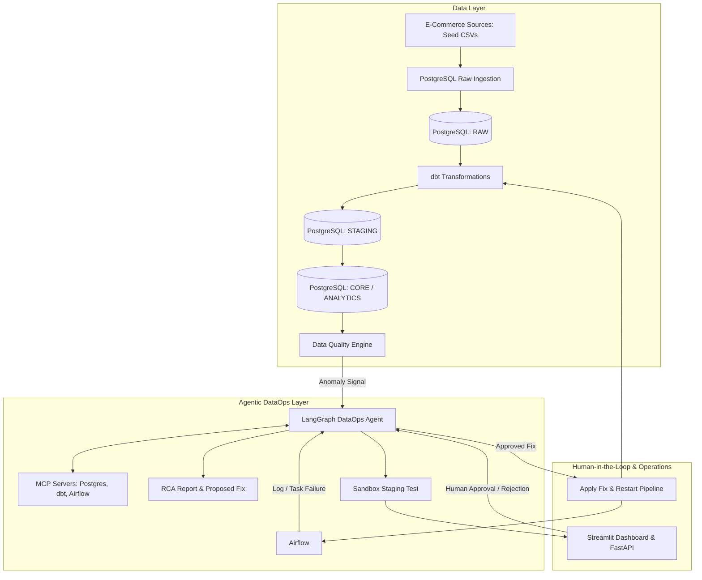

# Implementation Plan: DataGuardian — Agentic DataOps Platform

DataGuardian is an end-to-end Agentic DataOps platform designed for autonomous monitoring, incident detection, root cause analysis (RCA), sandbox test validation, and human-approved remediation of data pipelines.

---

## 1. System Architecture

---

## 2. Technology Stack & Component Roles

| Component | Technology | Primary Role & Responsibility |
| :--- | :--- | :--- |
| **Warehouse & DB** | PostgreSQL 15 | Multi-tenant database hosting `raw`, `staging`, `core`, `analytics`, `dataops`, and `staging_sandbox` schemas. |
| **Transformations** | dbt (dbt-postgres) | Modular SQL transformations, staging views, dimensional tables, and data tests. |
| **Orchestration** | Apache Airflow | Scheduled pipeline runs, task monitoring, log emission, and retry orchestration. |
| **Quality Engine** | dbt tests / Custom Assertions | Statistical and contract-based quality checks (null bounds, schema contracts, duplicate ratios). |
| **Agent Framework** | LangGraph + LangChain | Stateful graph execution, reasoning loops, tool routing, checkpointing, and HITL interrupts. |
| **Protocol Layer** | Model Context Protocol (MCP) | Decouples data tools (DB inspector, log reader, dbt manifest reader) from LLM runtime logic. |
| **Backend API** | FastAPI | REST endpoints for pipeline status, incident listing, triggering RCA, and approving fixes. |
| **Dashboard** | Streamlit | Visual dashboard for pipeline health, incident viewer, interactive RCA reports, and approval portal. |

---

## 3. Data Flow & Agentic Interaction

1. **Telemetry & Incident Trigger**:
   - Pipeline tasks fail or data quality checks detect anomalies.
   - An incident record is registered (`dataops.incidents`), triggering the LangGraph agent thread.
2. **Evidence Collection (Read-Only Tool Execution)**:
   - Agent inspects error logs, compares schemas, inspects dbt models, and executes read-only SQL queries.
3. **Reasoning & Fix Generation**:
   - Agent correlates historical metadata vs current failure state.
   - Builds a structured Root Cause Analysis (RCA) report.
   - Generates proposed SQL/dbt model code fixes.
4. **Sandbox Test Execution**:
   - Agent applies fixes in the isolated `staging_sandbox` schema and compiles/tests dbt to verify resolution.
5. **Human Approval Gate (LangGraph Interrupt)**:
   - Agent pauses execution (`WAITING_FOR_APPROVAL`).
   - Streamlit dashboard displays RCA, code diffs, and validation results for human review.
6. **Remediation & Pipeline Recovery**:
   - User approves fix in UI.
   - Agent applies the approved code fix and triggers pipeline recovery.
   - Verifies pipeline success and marks incident as `RESOLVED`.

---

## 4. Master Incremental Phases & Progress Tracker

- [x] **Phase 1: Environment & Project Scaffolding**
  - [x] Docker Compose setup (`postgres:15-alpine` container)
  - [x] Multi-schema database initialization (`raw`, `staging`, `core`, `analytics`, `dataops`, `staging_sandbox`)
  - [x] Project structure and environment variables (`.env`, `requirements.txt`)

- [x] **Phase 2: Seed Data Generation & Ingestion**
  - [x] Olist dataset sampled with 100% referential integrity (5,000 orders)
  - [x] Clean seed files created in `data/raw_seed/` (`customers`, `orders`, `payments`, `products`, `category_translations`)
  - [x] Incident simulation datasets created in `data/incident_simulations/` (schema drift, null spike, duplicates)
  - [x] Loaded raw data into PostgreSQL `raw` schema via `scripts/load_raw_tables.sql`

- [x] **Phase 3: dbt Models & Transformations Layer**
  - [x] `dbt_project.yml` and `profiles.yml` configuration (dev + sandbox targets)
  - [x] Source declarations (`dbt/models/staging/sources.yml`)
  - [x] Staging models (`stg_customers.sql`, `stg_orders.sql`, `stg_payments.sql`, `stg_products.sql`)
  - [x] Core dimensional models (`dim_customers.sql`, `fact_orders.sql`)
  - [x] Data quality schema tests & contracts (`dbt/models/schema.yml`)
  - [x] Compile and verify dbt setup

- [x] **Phase 4: Airflow Orchestration Pipeline**
  - [x] Airflow DAG definitions (`ecommerce_pipeline.py`)
  - [x] Ingestion, transformation, and quality check tasks
  - [x] Automated failure notification hooks

- [x] **Phase 5: Data Quality & Anomaly Detection Engine**
  - [x] Metric threshold assertion checks (null percentage, volume bounds)
  - [x] Anomaly emitter writing to `dataops.incidents`

- [x] **Phase 6: Incident Injection & Simulation Scripts**
  - [x] Automated script to inject simulated anomalies into live tables (`simulate_incident.py`)

- [ ] **Phase 7: Core Read-Only Agent Tools**
  - [ ] Postgres schema inspection & query execution tools
  - [ ] Airflow DAG status & log extraction tools
  - [ ] dbt model & manifest lineage traversal tools

- [ ] **Phase 8: LangGraph State & Node Graph Definition**
  - [ ] `IncidentState` TypedDict definition
  - [ ] Graph nodes: `triage`, `investigate_logs`, `analyze_schema`, `generate_rca`, `sandbox_test`, `human_approval`, `remediate`
  - [ ] State persistence checkpointer

- [ ] **Phase 9: Root Cause Analysis (RCA) Engine**
  - [ ] Structured RCA prompt templates
  - [ ] Evidence-backed empirical JSON output validation

- [ ] **Phase 10: Code & Schema Fix Generator + Sandbox Tester**
  - [ ] LLM SQL/dbt model code patch generation
  - [ ] Sandbox execution in `staging_sandbox` schema
  - [ ] Validation against dbt tests

- [ ] **Phase 11: Human-in-the-Loop (HITL) & Write Tools**
  - [ ] LangGraph `interrupt_before=["apply_approved_fix"]`
  - [ ] Safe patch applicator tool & pipeline restart trigger

- [ ] **Phase 12: FastAPI Management Backend**
  - [ ] REST endpoints: `/pipelines/status`, `/incidents`, `/incidents/{id}/approve`, `/simulate`

- [ ] **Phase 13: Streamlit Operational Dashboard**
  - [ ] Real-time pipeline health overview
  - [ ] Incident audit log & LangGraph reasoning trace viewer
  - [ ] RCA report viewer with interactive human approval/rejection buttons

- [ ] **Phase 14: Model Context Protocol (MCP) Integration**
  - [ ] Expose Postgres, dbt, and Airflow toolsets as standard MCP servers

- [ ] **Phase 15: End-to-End Integration Testing & Documentation**
  - [ ] Automated end-to-end incident recovery test (`pytest`)
  - [ ] Project showcase README with architecture diagrams
